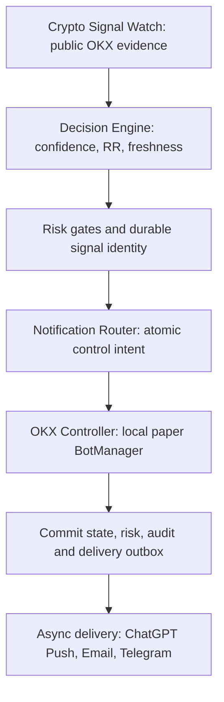

# Crypto Signal Watch v5 — direct paper OKX control

TradingView can be disconnected completely. There is no TradingView webhook,
signal subscription, trading credential, or network exchange-write transport in
this chain. TradingView may be used independently to visualize market charts.

## Execution flow



**Paper only. LIVE TRADING OFF.** The OKX control interface is simulated locally.
Managing an actual OKX account's bots would require exchange trading permissions,
which are deliberately absent. Do not interpret `code=0` / PAPER_APPLIED as an
actual exchange acknowledgement; the response explicitly includes `simulated`,
`paper_only=true`, `live_execution=false`. No real bot was started or stopped.
The public market-data connectors remain keyless and read-only.

## BotManager and registry

`src/quant_trading_platform/okx_controller/` implements start_bot, stop_bot,
pause_bot, resume_bot, close_position_if_supported, get_bot_status, get_positions
and get_orders. All requests use the same bounded three-attempt retry path with
exponential waits of 1 and 2 seconds for transient failures. Permanent state or
input errors are rejected immediately. Paper retries roll back their savepoint
before replay and reuse the durable operation identity. Requests and responses
are recorded in structured logs and the paper_control_requests table; upstream
exception text is not recorded. A complete rejected execution has its own audit
record. Uncommitted SQL attempt records are rolled back with their enclosing
execution if that transaction itself fails, while structured diagnostic logs
remain available.

`bot_registry.yaml` defines BTC_GRID, ETH_GRID, SOL_GRID, BTC_DCA, ETH_DCA,
SOL_DCA and PAIR_BTC_ETH, including bot_id, symbol, strategy, status, created_at,
last_signal. It is a seed/definition file. Runtime status and last_signal are
persisted atomically in paper_bots, not rewritten into YAML concurrently. Restart
loads persisted state without resetting active bots. PAIR_BTC_ETH is DISABLED:
there is no two-leg strategy or implicit BTC/ETH trading implementation.

START reserves paper capital; it does not fabricate an exchange order or fill.
get_positions returns explicitly labelled paper_capital_reservation records and
get_orders returns an empty list. STOP halts the bot while retaining allocated
capital. PAUSE retains allocations and RESUME is allowed only from PAUSED.
CLOSE releases a local paper reservation and stops the bot. It does not liquidate
any actual OKX holding. The lifecycle simulation is separate from the existing
OKX spot paper fills/account and does not silently consume that account's balances.

## Decisions and disclosed policies

Input Signal carries stable identity, symbol, LONG/SHORT/STOP/CLOSE intent,
confidence, score, RR, market regime, volatility, ATR percentage, trend strength,
notional, risk amount, creation time and original evidence expiry.
All financial values must already be finite nonnegative Decimal, never float.

- EXECUTE accepts only HIGH (72 to below 84) or VERY_HIGH (84–100), a fresh signal,
  RR >=2 and positive sizing with risk <= notional. Only spot LONG is supported.
- DCA: trending regime, trend strength >=0.6, volatility <=3%, ATR/price in (0,3%].
- GRID: other valid trend/range cases with volatility <=5% and ATR/price in (0,3%].
- Default limits: USD 200 planned daily risk, USD 1000 reserved exposure,
  10% drawdown, 60-second bot cooldown, 1-second signal age. Typed RiskLimits can
  override these simulation limits. Daily risk uses UTC days and survives restart.
- Existing active/paused allocations for the same asset block another entry.
  Drawdown, daily risk, exposure, bot state and cooldown reject starts.
- Explicit STOP/CLOSE and a healthy completed-bar range above 5% use the unique
  existing bot's safety-exit path. Emergency exits do not require HIGH confidence
  or pass entry-only risk/cooldown limits; freshness and unambiguous target still
  apply. STOP never becomes CLOSE implicitly.
- The Watch bridge calculates a 14-bar average true range from completed public
  candles, and RR from observed support/close/resistance. A missing upside target
  gives RR=0 and IGNORE. Unhealthy or expired evidence cannot authorize an entry.
  No target, RR, confidence or fresh timestamp is fabricated for missing evidence.

Daily planned-risk usage is a budget, not realized P&L. Drawdown is paper risk
metadata updated through set_drawdown; this bot lifecycle simulator does not
claim to calculate actual trading returns or tune itself from unobserved fills.

## Atomicity, latency and notifications

One BEGIN IMMEDIATE transaction reserves the signal/control intent, checks risk,
changes paper bot state, updates daily risk, saves the full execution audit and
queues delivery. An audit/outbox failure rolls everything back. Duplicate signal
IDs return the existing result and cannot reapply a command, including after
restart. Each result exposes event_id, signal_id, bot_id, execution_result and
delivery_result. Audit stores timestamp, symbol, reason, score, confidence,
bot action and the labelled paper OKX response.

The delivery worker runs independently of scanning. It sends every completed
action or rejected decision through the existing NotificationRouter. Existing
fixed-recipient Composio Telegram, authenticated-mailbox Email, backoff and
uncertain-delivery idempotency remain unchanged. The worker updates delivery_result
without rerunning a bot command. Signal ID and event ID link both audit trails.
ChatGPT Push → Email → Telegram keeps the established channel order. All three
receipts are still required for aggregate SENT.

The <1-second target applies to healthy local paper control after a signal reaches
the engine, including its transaction commit. It excludes public candle polling,
API retry backoff and asynchronous notification delivery. A local 10-start benchmark
measured 132–526 microseconds (mean 205), including commit. This is not a guarantee
of real OKX API or Telegram latency. Unavailable APIs are never claimed successful.

Native authorized notification bindings are still required. In the previous Native
session, Telegram and Email were tested and Telegram receipt was confirmed by the
user; ChatGPT Push had no available acknowledgement transport. This PR cannot make
that missing host capability exist. Tests use explicit transport doubles for the
three-channel success case, and unbound channels fail closed. It does not deploy
or alter the separately running scheduled workflow or OKX account.

## Run and verify

Run from the repository root so bot_registry.yaml resolves; BOT_REGISTRY_PATH
can point to another validated registry. Docker images copy the registry.
The FastAPI paper lifespan initializes the manager/engine on the Watch journal,
and Watch uses it automatically when TRADING_MODE=paper and LIVE_TRADING_ENABLED=false.
There are no new live or unauthenticated bot-command HTTP endpoints. Watch GETs
remain cached read-only diagnostics and never dispatch commands.

```bash
pip install -c constraints-py311-linux.txt -e '.[dev]'
black --check --line-length 100 src/quant_trading_platform/okx_controller src/quant_trading_platform/execution_engine.py tests/test_direct_okx_control.py
ruff check .
mypy src
pytest -q
pytest -q tests/test_direct_okx_control.py --cov=quant_trading_platform.okx_controller --cov=quant_trading_platform.execution_engine --cov-branch --cov-fail-under=95
python -m compileall src tests
python scripts/check_secret_hygiene.py
cd frontend
npm ci
npm run build
npm test
```

The >=95% gate covers the new direct-control modules (statements and branches),
not a claim that every pre-existing backend module has 95% coverage. See
V5_VERIFICATION.md for actually executed checks and limitations.
